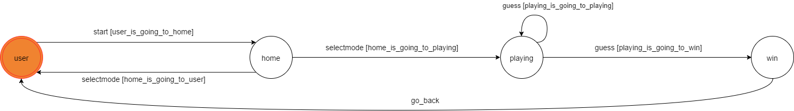

# finalcode

Homework for TOC Project 2020

A Line bot based on a finite state machine

## Setup

### Prerequisite
* Python 3.6
* Pipenv
* Facebook Page and App
* HTTPS Server

#### Install Dependency
```sh
pip3 install pipenv

pipenv --three

pipenv install

pipenv shell
```


## Finite State Machine


## Usage
The initial state is set to `user`.


* user
	* Input: "終極密碼start"
		* Reply: "遊戲開始 輸入'1'開始遊戲 輸入'exit'離開遊戲"
			* Input: "1"
				* 重複直到猜對:
					* Reply: "請輸入幾到幾的數字"
					* Input: 猜的數字
				* 猜對:
					* Reply: "YOU GOT IT! 遊戲結束"
					* 回到user
			* Input: "exit"
				* Reply: "Byebye"
				* 回到user


## Deploy
Setting to deploy webhooks on Heroku.

### Heroku CLI installation

* [macOS, Windows](https://devcenter.heroku.com/articles/heroku-cli)

or you can use Homebrew (MAC)
```sh
brew tap heroku/brew && brew install heroku
```

or you can use Snap (Ubuntu 16+)
```sh
sudo snap install --classic heroku
```

### Connect to Heroku

1. Register Heroku: https://signup.heroku.com

2. Create Heroku project from website

3. CLI Login

	`heroku login`

### Upload project to Heroku

1. Add local project to Heroku project

	heroku git:remote -a {HEROKU_APP_NAME}

2. Upload project

	```
	git add .
	git commit -m "Add code"
	git push -f heroku master
	```

3. Set Environment - Line Messaging API Secret Keys

	```
	heroku config:set LINE_CHANNEL_SECRET=your_line_channel_secret
	heroku config:set LINE_CHANNEL_ACCESS_TOKEN=your_line_channel_access_token
	```

4. Your Project is now running on Heroku!

	url: `{HEROKU_APP_NAME}.herokuapp.com/callback`

	debug command: `heroku logs --tail --app {HEROKU_APP_NAME}`

5. If fail with `pygraphviz` install errors

	run commands below can solve the problems
	```
	heroku buildpacks:set heroku/python
	heroku buildpacks:add --index 1 heroku-community/apt
	```

	refference: https://hackmd.io/@ccw/B1Xw7E8kN?type=view#Q2-如何在-Heroku-使用-pygraphviz

## Reference
[Pipenv](https://medium.com/@chihsuan/pipenv-更簡單-更快速的-python-套件管理工具-135a47e504f4) ❤️ [@chihsuan](https://github.com/chihsuan)

[TOC-Project-2020](https://github.com/NCKU-CCS/TOC-Project-2020) ❤️ [@NCKU-CCS](https://github.com/NCKU-CCS)

Flask Architecture ❤️ [@Sirius207](https://github.com/Sirius207)

[Line line-bot-sdk-python](https://github.com/line/line-bot-sdk-python/tree/master/examples/flask-echo)
